# SmartLockerKiosk Patent Drawing Set

Prepared as editable conceptual drawings for patent counsel. These are not formal USPTO line drawings, but they are structured so a patent illustrator can convert them into formal figures.

## Figure 1 - System Architecture

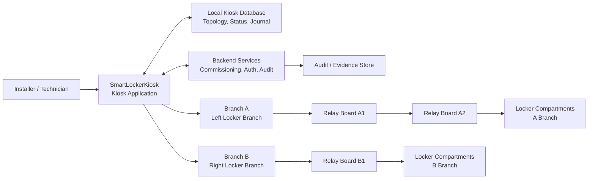

## Figure 2 - Commissioning Flow

```mermaid
flowchart TD
    Start["Power locker system"]
    Boot["Kiosk boots to commissioning screen"]
    Network["Validate network connection"]
    Code["Enter commissioning code"]
    Validate["Backend validates commissioning session"]
    Download["Download branding, workflow,<br/>location, kiosk ID, policy"]
    DetectPorts["Detect USB / COM controller ports"]
    AssignBranches["Assign detected ports to Branch A / Branch B"]
    ConnectBoards["Connect to relay boards"]
    OpenScan["Run Open All scan"]
    DetectDoors["Detect responsive locker doors"]
    Troubleshoot["Display detected doors<br/>for troubleshooting"]
    CloseSeq["Close doors in desired numbering sequence"]
    InferSize["Infer size where supported"]
    Confirm["Confirm commissioning map"]
    Persist["Persist topology and initial status"]
    Finalize["Finalize with backend"]
    Invalidate["Invalidate commissioning code"]
    Launch["Launch operational kiosk mode"]

    Start --> Boot --> Network --> Code --> Validate --> Download
    Download --> DetectPorts --> AssignBranches --> ConnectBoards
    ConnectBoards --> OpenScan --> DetectDoors --> Troubleshoot
    Troubleshoot --> CloseSeq --> InferSize --> Confirm --> Persist
    Persist --> Finalize --> Invalidate --> Launch
```

## Figure 3 - Branch and Daisy-Chained Relay Board Topology

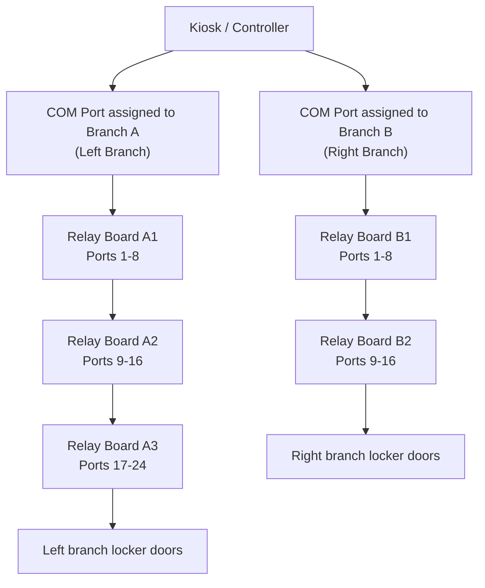

## Figure 4 - Open-Scan Detection and Troubleshooting

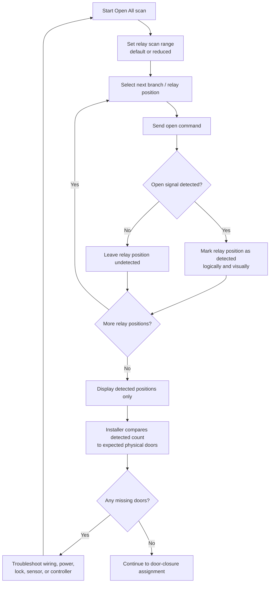

## Figure 5 - Door-Closure Sequence Assignment

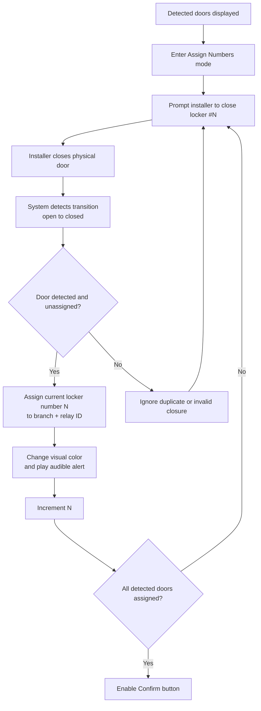

## Figure 6 - Relay ID to Board and Port Mapping

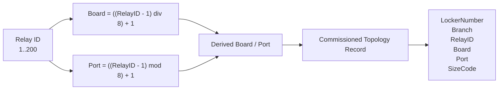

## Figure 7 - Size Inference From One Board Per Column

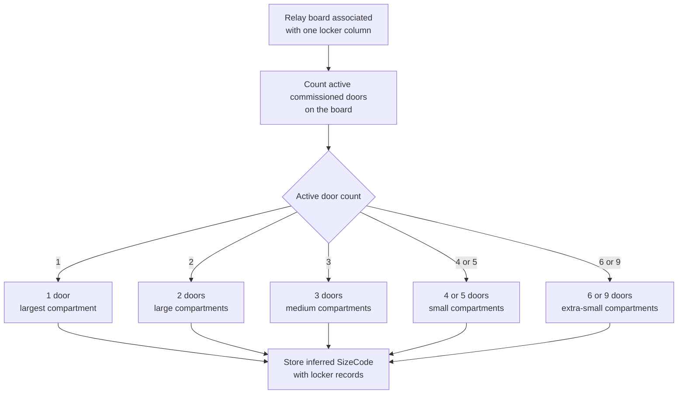

## Figure 8 - Runtime Authorization and Acknowledgement

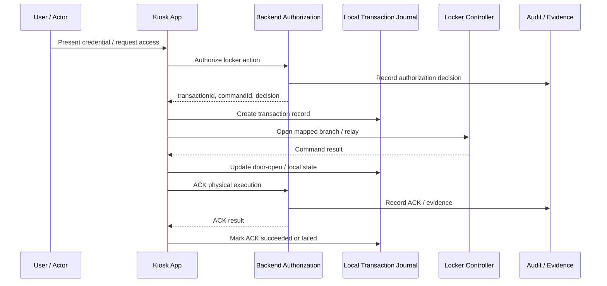

## Figure 9 - Transaction Journal State Machine

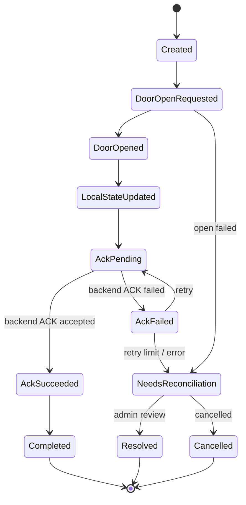

## Figure 10 - Proximity-Aware Locker Selection

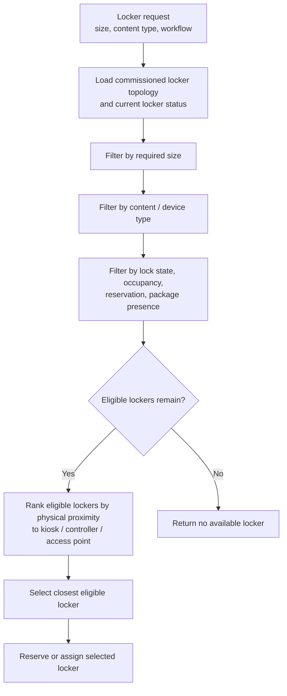

## Figure 11 - Integrated Commissioned Governance Loop

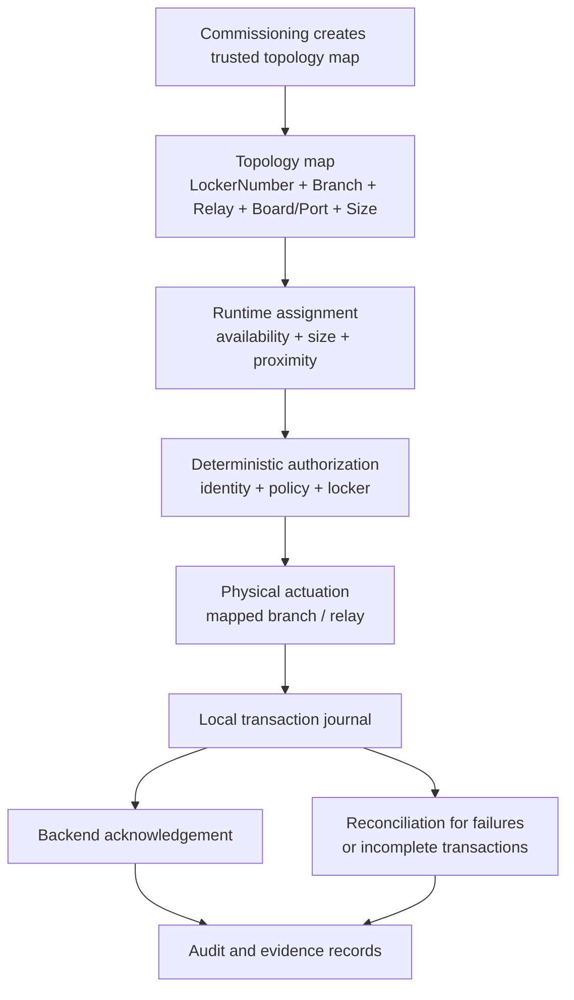

## Figure 12 - Example Physical Numbering Sequence

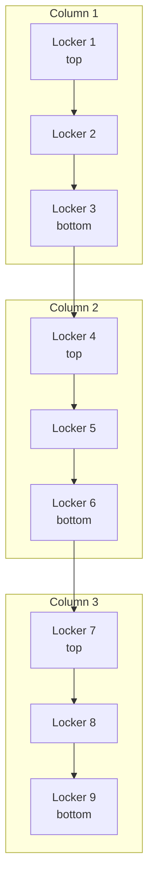

Note: Figure 12 shows a conventional numbering sequence. The commissioning system may assign any desired numbering order because the number is assigned according to the sequence in which the installer closes physical doors.

